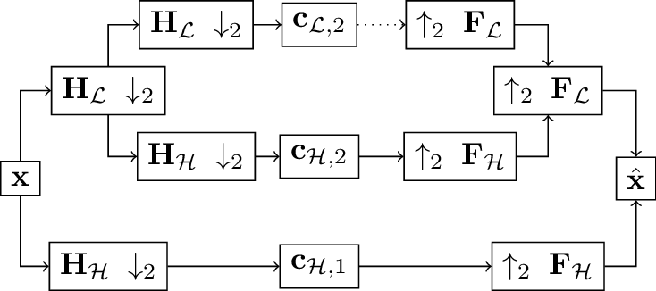
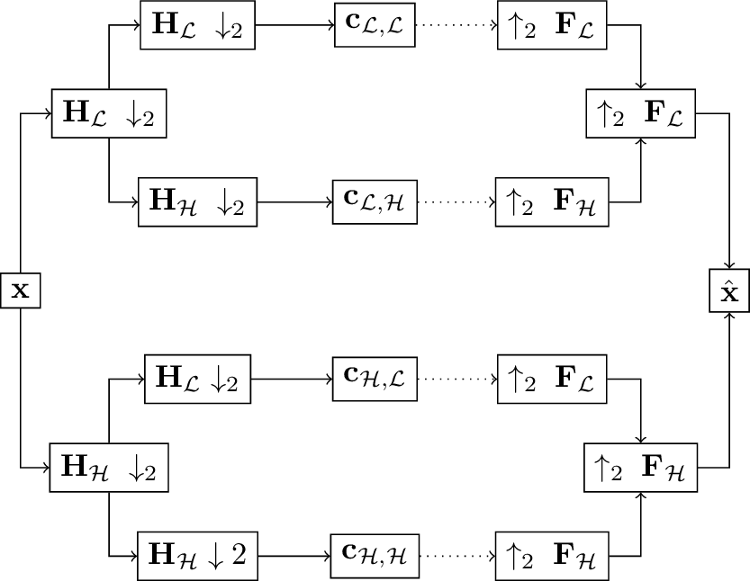
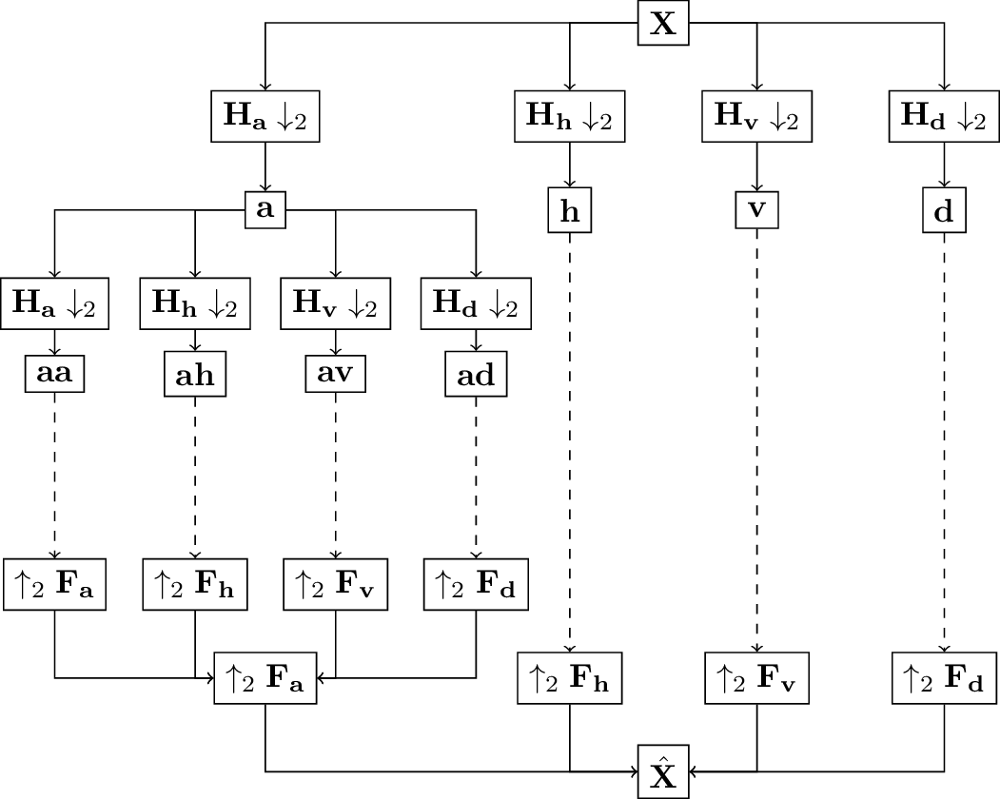

Introduction to discrete wavelet transforms
===========================================

This text summarizes key wavelet facts as a convenience for the hasty reader.
See, for example, :cite:`strang1996wavelets,mallat1999wavelet`
or :cite:`jensen2001ripples` for excellent detailed introductions to the topic.
This text is partially based material from :cite:`wolter2022wavelet`.

The **Fast Wavelet Transform (FWT)** relies on convolution operations with filter pairs.

.. _fig-fwt:

   Overview of the FWT computation.

:numref:`fig-fwt` illustrates the process in one dimension.
:math:`\mathbf{x}` denotes the input signal,
:math:`\mathbf{h}_\mathcal{A}` and :math:`\mathbf{h}_\mathcal{D}` the analysis low-pass filter and high-pass filter,
:math:`\mathbf{f}_\mathcal{A}` and :math:`\mathbf{f}_\mathcal{D}` the synthesis filter pair.
:math:`\downarrow_2` denotes downsampling with a factor of two, :math:`\uparrow_2` means upsampling.
In machine learning terms, the analysis transform relies on stride two convolutions.
The synthesis or inverse transform on the right works with stride two transposed convolutions.
:math:`\mathbf{H}_{k}` and :math:`\mathbf{F}_{k}` with :math:`k \in [\mathcal{A}, \mathcal{D}]`
denote the corresponding convolution operators.

The FWT can be described as a multiscale approach.
The signal is decomposed into approximation coefficients (denoted by :math:`\mathcal{A}`)
and detail coefficients (:math:`\mathcal{D}`).
This is repeated on multiple levels by decomposing the approximation coefficients of the previous level, i.e.

.. math::
   \mathbf{c}_{k, s+1} = \downarrow_2(\mathbf{c}_{\mathcal{A}, s} * \mathbf{h}_k) \qquad \text{for}\ k \in [\mathcal{A}, \mathcal{D}]

where :math:`s \in \mathbb{N}_0` denotes the level and :math:`\mathbf{c}_{\mathcal{A}, 0}:= \mathbf{x}`
is the original input signal.
Each decomposition step halves the size of the coefficients as a downsampling is applied on each level.
The 1d FWT is imlemented in :py:meth:`ptwt.wavedec`.
:py:meth:`ptwt.waverec` provides the inverse functionality visible
on the righthand side of :numref:`fig-fwt`.

The **Wavelet Packet Transform (WPT)** additionally expands the high-frequency part of the tree.
The figure below depicts the idea.

.. _fig-wpt:

   Scematic drawing of the full WPT in a single dimension. Compared to :numref:`fig-fwt`, the high-pass filtered side of the tree is expanded, too.

Whole expansion is not the only possible way to construct a wavelet packet tree.
See :cite:`jensen2001ripples` for a discussion of other options.

In :numref:`fig-fwt` and :numref:`fig-wpt`, capital letters denote convolution operators.
These may also be expressed as Toeplitz matrices :cite:`strang1996wavelets`.
The matrix nature of these operators explains the capital boldface notation.
Coefficient subscripts record the path that leads to a particular coefficient.
:py:meth:`ptwt.WaveletPacket` provides this functionality for single dimensional inputs.

.. _sec-fwt-2d:

The two-dimensional transform
-----------------------------

This toolbox provides two dimensional input processing functionality.
We construct filter quadruples from the original filter pairs to process two-dimensional inputs.
The process uses outer products :cite:`vyas2018multiscale`:

.. math::
    \mathbf{h}_{a} = \mathbf{h}_\mathcal{A}\mathbf{h}_\mathcal{A}^T,
    \mathbf{h}_{h} = \mathbf{h}_\mathcal{A}\mathbf{h}_\mathcal{D}^T,
    \mathbf{h}_{v} = \mathbf{h}_\mathcal{D}\mathbf{h}_\mathcal{A}^T,
    \mathbf{h}_{d} = \mathbf{h}_\mathcal{D}\mathbf{h}_\mathcal{D}^T

With :math:`a` for approximation, :math:`h` for horizontal,
:math:`v` for vertical, and :math:`d` for diagonal :cite:`lee2019pywavelets`.

With the four filters we are now able to compute,

.. math::
  \mathbf{x}_s *_2 \mathbf{h}_k = \mathbf{c}_{k, s+1}

with :math:`k \in [a, h, v, d]` and :math:`s \in \mathbb{N}_0` the set of natural numbers,
where :math:`\mathbf{x}_0` is equal to
the original input image :math:`\mathbf{X}`. :math:`*_2` indicates two dimensional-convolution.
Computations at subsequent scales work exclusively with approximation coefficients :math:`c_{a, s}` as inputs.
The figure below illustrates the process.

.. _fig-fwt2d:

.. figure:: figures/fwt_2d.png
   :scale: 45 %
   :alt: 2d wavelet transform computation diagram.
   :align: center

   Two-dimensional wavelet transform computation diagram. :math:`\mathbf{X}` and :math:`\hat{\mathbf{X}}` denote input image and
   reconstruction respectively.

:py:meth:`ptwt.wavedec2` and :py:meth:`ptwt.waverec2` support forward
and backward transforms respectively. Potential further decomposition of all coefficient leads us to
wavelet packets.

.. _fig-wpt2d:

   Two-dimensional wavelet packet transform computation diagram. Dashed lines indicate potential full expansion of the tree.

:numref:`fig-wpt2d` illustrates the computation of a full two-dimensional wavelet packet tree.
At higher scales, all resulting coefficients from previous scales serve as inputs.
The four filters repeatedly convolved with all outputs to build the full tree. The inverse transforms work analogously.
:py:meth:`ptwt.WaveletPacket2D` provides this functionality.
We refer to the standard literature :cite:`jensen2001ripples,strang1996wavelets` for an extended discussion.

Compared to the FWT, the high-frequency half of the tree is subdivided into more bins,
yielding a fine-grained view of the entire spectrum.
We always show analysis and synthesis transforms to stress that all wavelet transforms are lossless.
Synthesis transforms reconstruct the original input based on the results from the analysis transform.

See also :ref:`common-wavelets` for a discussion of common wavelets and their properties.
