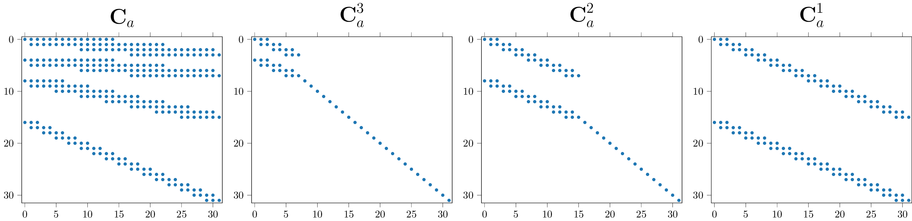
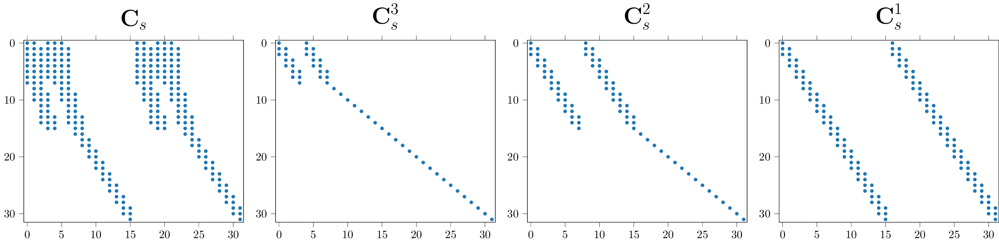
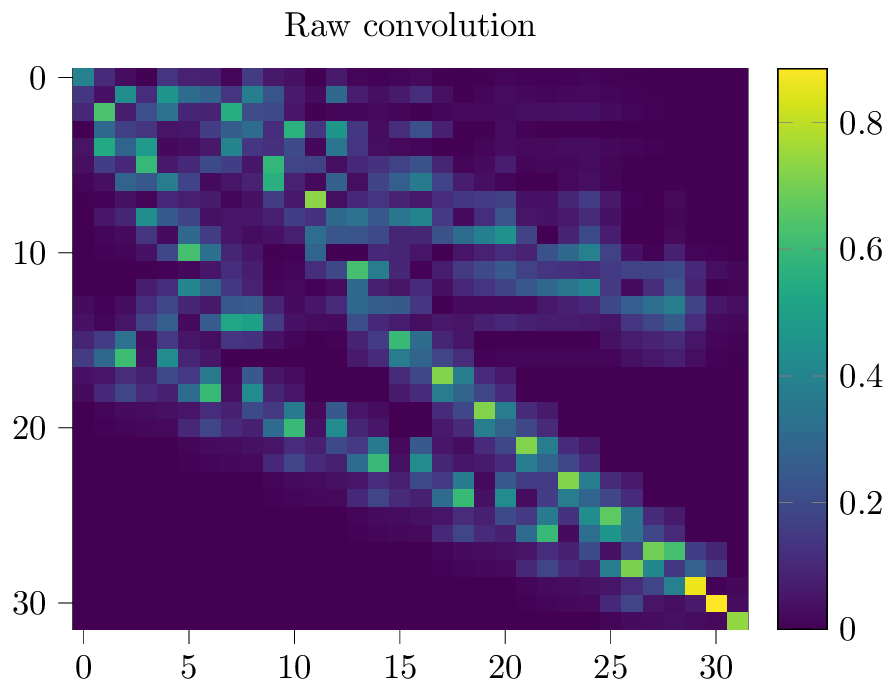
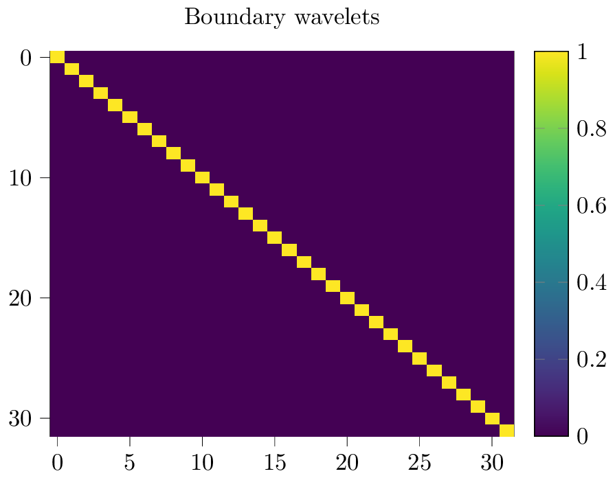
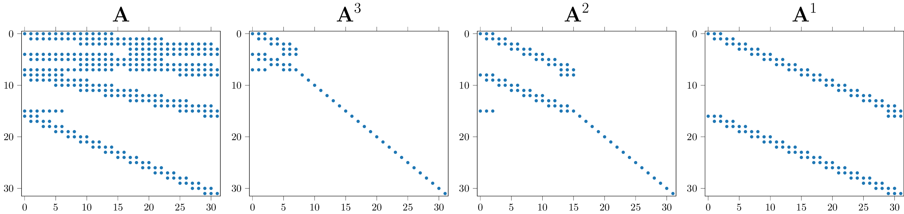
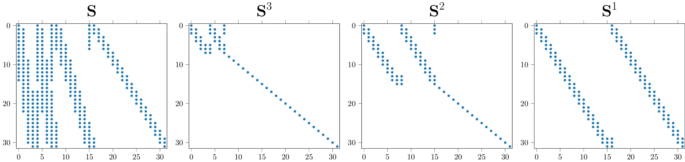
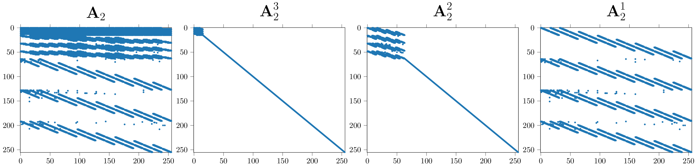
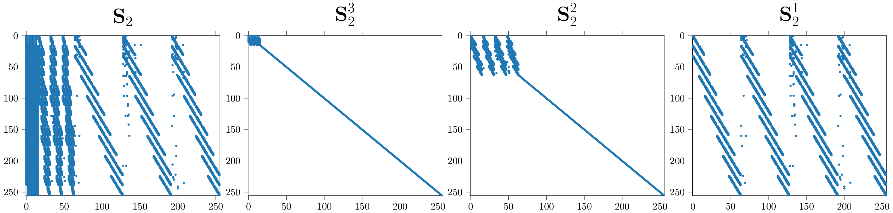

.. _sec-boundary-wavelets:

Introduction to boundary wavelet filters
========================================

This intro provides a brief introduction to the concept of boundary wavelets based on
material from :cite:`wolter2022wavelet`. The key idea here is to work with the matrix form of the FWT.

The **Fast Wavelet Transform (FWT)** :cite:`mallat1999wavelet` utilizes convolutions to
decompose an input signal into its frequency components. Repeated applications of the wavelet
transform result in a multi-scale analysis. Convolution is a linear operation, and linear
operations are often written in matrix form. Consequently, we aim to find a matrix that allows
the computation of the fast wavelet transform :cite:`strang1996wavelets`:

.. math::
    \mathbf{b} = \dots \mathbf{A}\mathbf{x}  .

:math:`\mathbf{A}` is a product of multiple scale matrices. The non-zero elements in :math:`\mathbf{A}` are
populated with the coefficients from the selected filter pair.
Given the wavelet filter degree :math:`d`, each filter has :math:`N = 2d` coefficients.
Repeating diagonals compute convolution operations with the so-called analysis filter vector pair
:math:`\mathbf{f}_\mathcal{L}` and :math:`\mathbf{f}_\mathcal{H}`, where the filters are arranged
as vectors in :math:`\mathbb{R}^N`. The subscripts :math:`\mathcal{L}` denote the one-dimensional
low-pass and :math:`\mathcal{H}` the high pass filter, respectively.
The filter pair appears within the diagonal patterns of the stride two convolution matrices
:math:`\mathbf{H}_\mathcal{L}` and :math:`\mathbf{H}_\mathcal{H}`.
Overall one observes the pattern :cite:`strang1996wavelets`

.. math::
    \mathbf{A}=
    \dots
    \begin{pmatrix}
    \begin{array}{c|c}
    \mathbf{H}_\mathcal{L} &  \\
    \mathbf{H}_\mathcal{H} &  \\ \hline
    & \mathbf{I} \\
    \end{array}
    \end{pmatrix}
    \begin{pmatrix}
    \mathbf{H}_\mathcal{L} \\ \mathbf{H}_\mathcal{H}
    \end{pmatrix}.

The equation describes the first two FWT-matrices. Instead of the dots, we can imagine additional scale matrices.
The analysis matrix :math:`\mathbf{A}` records all operations by matrix multiplication.
The :py:meth:`ptwt.MatrixWavedec` function provides access to the matrix form of the analysis operation.
Including boundary filter treatment, which we will discuss in an upcoming section.

.. _fig-conv-analysis:

  Truncated single-dimensional analysis convolution matrices for a signal of length 32 using for
  example a Daubechies-two wavelet. The decomposition level increases from right to left.
  On the leftmost side the product of the first three is shown.
  We are looking at truncated versions of the infinite matrices described by the equation above.
  The title reads :math:`\mathbf{C}_a` because the analysis convolution matrix is different from the wavelet matrix,
  we discuss why in section on boundary filters below.

In Figure :numref:`fig-conv-analysis`, we illustrate a level three transform,
where we see the above equation at work. Ideally, :math:`\mathbf{A}` is infinitely large and orthogonal.
For finite signals, the ideal matrices have to be truncated. :math:`\mathbf{C}` denotes finite length
untreated convolution matrices, subscript :math:`a` and :math:`s` mark analysis, and transposed synthesis convolutions.
Second-degree wavelet coefficients from four filters populate the convolution matrices.
The identity tail of the individual matrices grows as scales complete.
The final convolution matrix is shown on the left.

Common choices for 1D wavelets are the Daubechies-wavelets `db` and their less asymmetrical variant, the Symlets `sym`.
We refer the reader to :cite:`mallat2009wavelet` for an in-depth discussion.
Note that the FWT is invertible, to construct the synthesis matrix
:math:`\mathbf{S}` for :math:`\mathbf{S} \mathbf{A}~=~\mathbf{I}`,
we require the synthesis filter pair :math:`\mathbf{f}_\mathcal{L}, \mathbf{f}_\mathcal{H}`.
The filter coefficients populate transposed convolution matrices.
To ensure the transform is invertible and visualizations interpretable,
not just any filter will do.The perfect reconstruction and anti-aliasing conditions must hold.

.. _subsec:ifwt:

Inverting the transform
------------------------

Earlier, we saw the structure of the Analysis matrix :math:`\mathbf{A}`.
Its inverse is, again, a linear operation. We can write:

.. math::
  \mathbf{S}\mathbf{b} = \mathbf{x}.

The synthesis matrix :math:`\mathbf{S}` reverts the operations in :math:`\mathbf{A}`.
To construct it one requires the synthesis filter pair :math:`\mathbf{f}_\mathcal{L}, \mathbf{f}_\mathcal{H}`
:cite:`strang1996wavelets`. Structurally, the synthesis matrices are transposed
in comparison to their analysis counterparts.
Using the transposed convolution matrices :math:`\mathbf{F}_\mathcal{L}` and
:math:`\mathbf{F}_\mathcal{H}`, :math:`\mathbf{S}`, one builds:

.. math::
  \mathbf{S}=
  \begin{pmatrix}
  \mathbf{F}_\mathcal{L} & \mathbf{F}_\mathcal{H}
  \end{pmatrix}
  \begin{pmatrix}
  \begin{array}{c c| c}
  \mathbf{F}_\mathcal{L} & \mathbf{F}_\mathcal{H} &  \\ \hline
    & & \mathbf{I} \\
  \end{array}
  \end{pmatrix}
  \dots .

The pattern here is analogous to the one we saw for the analysis equation. The :py:meth:`ptwt.MatrixWaverec`
function provides access to the matrix form of the analysis operation.

.. _fig-conv-synthesis:

  Sparsity pattern of the truncated 32 by 32 level 3 synthesis convolution matrix, and its scale components.
  The three individual decomposition matrices are shown in increasing order from the right to the left.
  On the very left the product of all three is shown.
  The pattern occurs for second-degree wavelets.

In Figure :numref:`fig-conv-synthesis` we show a truncated example.
In comparison to Figure :numref:`fig-conv-analysis` the structure is transposed.
Note, in order to guarantee invertibility, one must have :math:`\mathbf{S} \mathbf{A}~=~\mathbf{I}`.
Which is the case for infinitely large matrices.
When working with real truncated matrices, one requires boundary wavelet treatment.

Boundary filter treatment
-------------------------

So far, we have described the wavelet transform without considering the finite size of the images.
For example, the simple Haar wavelets can be used without modifications in such a case.
But, for the transform to preserve all information and be invertible, higher-order wavelets
require modifications at the boundary :cite:`strang1996wavelets`.
There are different ways to handle the boundary, including zero-padding, symmetrization, periodic extension,
and specific filters on the boundary.
The disadvantage of zero-padding or periodic extensions is that discontinuities
are artificially created at the border. With symmetrization,
discontinuities of the first derivative arise at the border :cite:`jensen2001ripples`.
Furthermore, padding increases the number of coefficients,
which is sometimes undesirable in neural-network applications.
Therefore, we provide code for special boundary filters in the form of the
so-called Gram-Schmidt boundary filters :cite:`jensen2001ripples`.

.. _fig-raw:

  The effect of boundary wavelet treatment.
  Single-dimensional Transformation-Matrices of shape 32 by 32 are constructed.
  This plot shows the element-wise absolute values of :math:`\mathbf{C_s} \cdot \mathbf{C_a}`.

The idea is now to replace the filters at the boundary with specially constructed,
shorter filters that preserve both the length and the perfect reconstruction property or other properties
of the wavelet transform.
Figure :numref:`fig-raw` illustrates why the procedure is required.
It illustrates the sparsity pattern of the matrix  :math:`\mathbf{C_s} \cdot \mathbf{C_a}`.
The two matrices should invert each other. Therefore,
we would have expected to see the diagonal pattern of the identity matrix.
As described above, Gram-Schmidt allows us to correct both matrices.

.. _fig-boundary:

  This plot illustrates the element-wise absolute values of :math:`\mathbf{S} \cdot \mathbf{A}`
  for orthogonalized analysis and synthesis matrices.
  The identity matrix indicates that our matrices have been correctly assembled.

We illustrate the impact of the procedure in Figure :numref:`fig-boundary`,
the product of the corrected boundary wavelet matrices :math:`\mathbf{S} \cdot \mathbf{A}` are shown.

Sparsity patterns of boundary wavelet matrices
----------------------------------------------

  Sparsity pattern of a 32 by 32 boundary wavelet analysis matrix, and its scale components.
  This pattern occurs for second-degree wavelets. All non-zero entries are shown.
  Additional entries appear in comparison to the raw-convolution matrix.

Figure :numref:`fig-conv-analysis` presented the single dimensional truncated analysis convolution matrices.
The plot above shows the sparsity pattern of an orthogonalized matrix.
This is an example pattern of an invertible matrix that :py:meth:`ptwt.MatrixWavedec` would actually use.

  Sparsity pattern of a 32 by 32 boundary wavelet synthesis matrix, and its scale components.
  Its synthesis counterpart with a transposed diagonal pattern is visible in Figure :numref:`fig-conv-synthesis`.

Similarly, the plot above shows an example of a sparsity pattern
of a synthesis matrix from :py:meth:`ptwt.MatrixWaverec`.

Two-dimensional sparse-transformation matrix plots
--------------------------------------------------

The :ref:`sec-fwt-2d` section introduced the two-dimensional wavelet transform.
The toolbox constructs filter quadruples from the original filter pairs to process two-dimensional inputs.
The process uses outer products :cite:`vyas2018multiscale`. We can construct convolution matrices from the
two-dimensional filter quadruples.
The toolbox provides the functions :py:meth:`ptwt.MatrixWavedec2` and :py:meth:`ptwt.MatrixWaverec2`
to access the matrix form of the two-dimensional wavelet transform.

.. _fig-boundary-analysis2d:

  Sparsity patterns of two-dimensional analysis FWT-matrices. Upper indices indicate individual scale matrices.
  The transformation matrix on the left is the matrix product of all three scale matrices.

Figure :numref:`fig-boundary-analysis2d` shows the sparsity pattern of a two-dimensional
orthogonalized analysis matrix, constructed with :py:meth:`ptwt.MatrixWavedec2`.

.. _fig-boundary-synthesis2d:

  Sparsity patterns of two-dimensional synthesis or IFWT matrices. Upper indices indicate individual scale matrices.
  The transformation matrix on the left is the matrix product of all three scale-matrices.

Similarly, the plot above shows an example matrix from :py:meth:`ptwt.MatrixWaverec2`.
