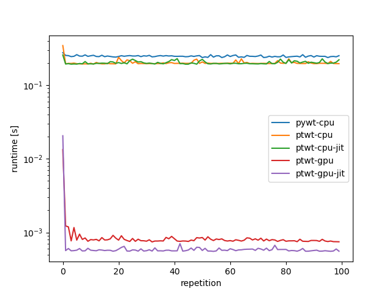
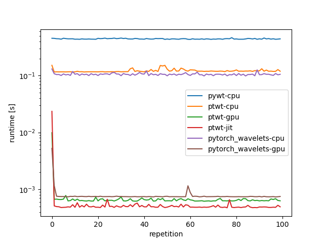
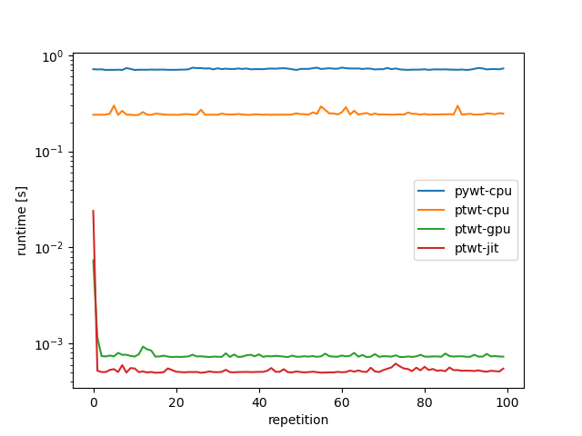

### Ptwt - Speed - Tests

To run the speed tests install [pywt](https://pywavelets.readthedocs.io/en/latest/install.html)
and [pytorch-wavelets](https://github.com/fbcotter/pytorch_wavelets).
The numbers below were measured using an NVIDIA TITAN Xp graphics card and an Intel(R) Core(TM) i9-10850K CPU @ 3.60GHz.

To execute the speed tests for the single-dimensional case run:
```bash
python timeitconv_1d.py
```
it produces the output and plot below:

```bash
1d-pywt-cpu:0.24683 +- 0.00607
1d-ptwt-cpu:0.20142 +- 0.01648
1d-ptwt-cpu-jit:0.20184 +- 0.01042
1d-ptwt-gpu:0.00093 +- 0.00125
1d-ptwt-jit:0.00078 +- 0.00198
```



For the two-2d fast wavelet decomposition case run:
```bash
python timeitconv_2d.py
```
Result:
```bash
2d-pywt-cpu:0.44354 +- 0.00654
2d-pytorch_wavelets-cpu:0.10569 +- 0.00506
2d-pytorch_wavelets-gpu:0.00080 +- 0.00045
2d-ptwt-cpu:0.12146 +- 0.00741
2d-ptwt-gpu:0.00074 +- 0.00092
2d-ptwt-jit:0.00073 +- 0.00229
```




Finally use
```bash
python timeitconv_3d.py
```
for the three dimensional case. It should produce something like the output below:

```bash
3d-pywt-cpu:0.72061 +- 0.01056
3d-ptwt-cpu:0.24678 +- 0.01168
3d-ptwt-gpu:0.00081 +- 0.00066
3d-ptwt-jit:0.00075 +- 0.00234
```

