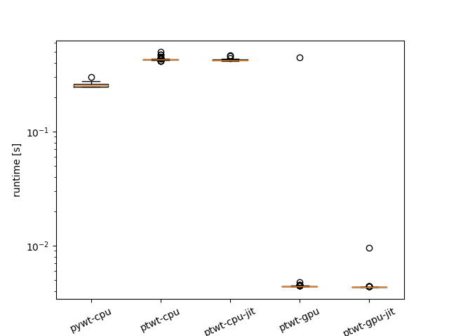
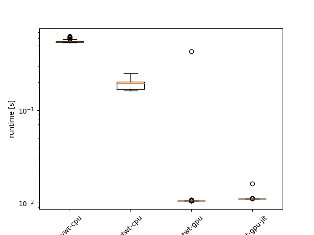
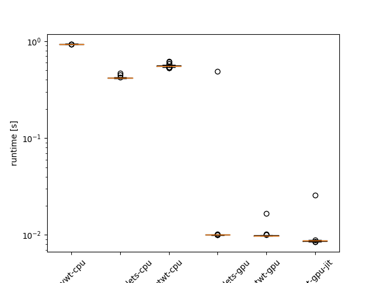
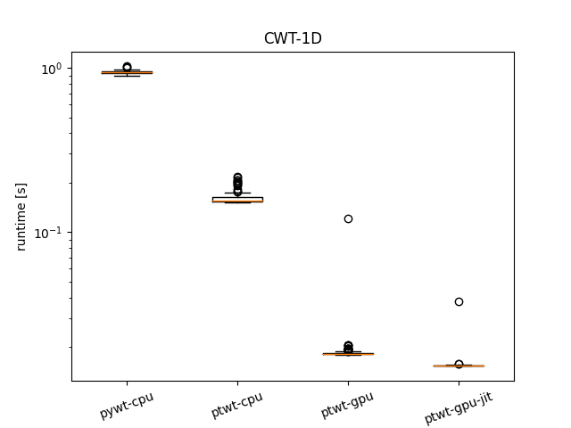

## Ptwt - Speed - Tests

To run the speed tests, install [pywt](https://pywavelets.readthedocs.io/en/latest/install.html) and [pytorch-wavelets](https://github.com/fbcotter/pytorch_wavelets) in addition to our ptwt.
The numbers below were measured using an NVIDIA RTX A4000 graphics card and an Intel(R) Xeon(R) W-2235 CPU @ 3.80GHz. We ship performant software. This readme lists our measurement results below. `run_all.sh` re-runs these tests on your machine.

### 1D-FWT

To execute the speed tests for the single-dimensional case run:
```bash
python timeitconv_1d.py
```
it produces the output and plot below:

```bash
1d-pywt-cpu    :0.25709 +- 0.00751
1d-ptwt-cpu    :0.42198 +- 0.00624
1d-ptwt-cpu-jit:0.42223 +- 0.00571
1d-ptwt-gpu    :0.00878 +- 0.04315
1d-ptwt-gpu-jit:0.00440 +- 0.00055
```

The 1d cython code from the pywt library does pretty well on our CPU. However, ptwt supports GPUs, which provide a speedup by several orders of magnitude.



### 2D-FWT

For the two-2d fast wavelet decomposition case run:
```bash
python timeitconv_2d.py
```
Result:
```bash
2d-pywt-cpu    :0.55641 +- 0.01785
2d-ptwt-cpu    :0.19519 +- 0.02337
2d-ptwt-gpu    :0.01468 +- 0.04192
2d-ptwt-gpu-jit:0.01110 +- 0.00051
```



### 2D-separable-FWT 

Separable transforms are also commonly implemented. Pytorch-wavelets does this see (2d-fwt-object)[https://github.com/fbcotter/pytorch_wavelets/blob/9a0c507f04f43c5397e384bb6be8340169b2fd9a/pytorch_wavelets/dwt/transform2d.py#L70] and the (underlying implementation)[https://github.com/fbcotter/pytorch_wavelets/blob/9a0c507f04f43c5397e384bb6be8340169b2fd9a/pytorch_wavelets/dwt/lowlevel.py#L312] . We study the performance with periodic padding below:

```bash
2d-pywt-cpu:0.93269 +- 0.00272
2d-pytorch_wavelets-cpu:0.41937 +- 0.00649
2d-pytorch_wavelets-gpu:0.01481 +- 0.04748
2d-ptwt-cpu    :0.55668 +- 0.01268
2d-ptwt-cpu-jit:0.54582 +- 0.00561
2d-ptwt-gpu    :0.00993 +- 0.00068
2d-ptwt-gpu-jit:0.00889 +- 0.00169
```





### 3D-FWT

Finally, use

```bash
python timeitconv_3d.py
```
for the three-dimensional case. It should produce something like the output below:

```bash
3d-pywt-cpu:0.83785 +- 0.03117
3d-ptwt-cpu:0.35998 +- 0.03619
3d-ptwt-gpu:0.00499 +- 0.04062
3d-ptwt-jit:0.01852 +- 0.17757
```


### CWT

The last experiment in this example studies the cwt implementation.

Run:

```bash
python timeitcwt_1d.py
```
to reproduce the result. We observe:

```bash
cwt-pywt-cpu:0.70588 +- 0.01531
cwt-ptwt-cpu:0.16132 +- 0.00837
cwt-ptwt-gpu:0.01798 +- 0.00392
cwt-ptwt-jit:0.00360 +- 0.00870
```
on our hardware.


